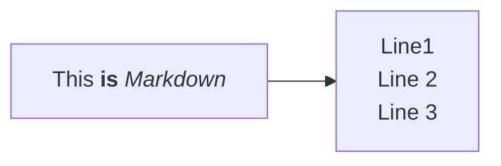
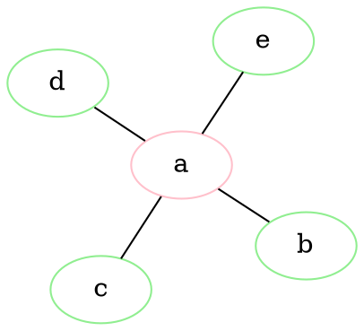
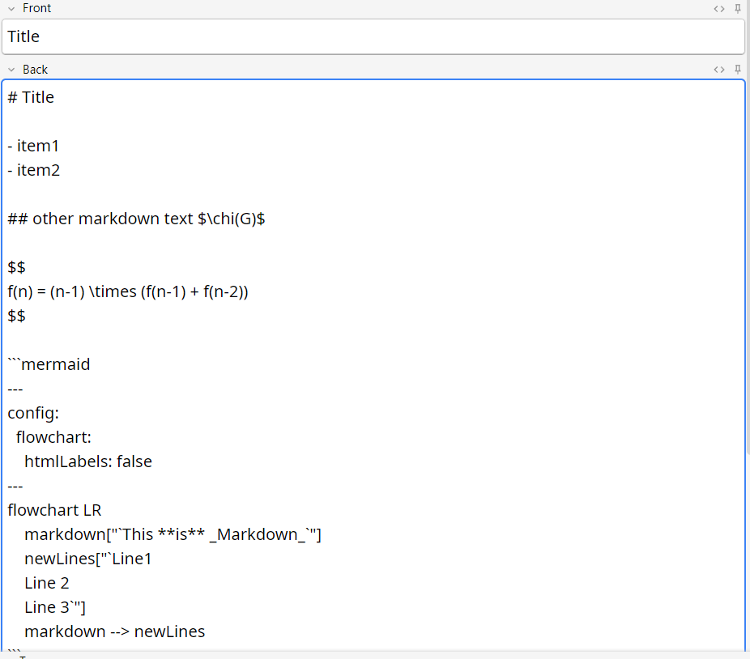
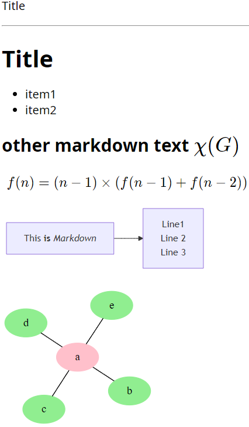

# anki-md

An Anki card template supports Markdown, KaTex, Mermaid and Graphviz.

## Supported syntax

Common Markdown syntax

```text
# Title

- item1
- item2
```

KaTex:

````text
## other Markdown text $\chi(G)$

$$
f(n) = (n-1) \times (f(n-1) + f(n-2))
$$

````

Mermaid:

````text

````

Graphviz's dot language:

````text

````

## Screenshots:

Edit note:



Review note:




## Create you own template

Requirements: node.js (npm command)

### Create an Anki Card Type

Open `Anki`, create a new Card Type (rename them at your will) with `Front Template`, `Back Template` and `Styling` as contents in `anki_template` directory of the project.

### Compile files

1. clone this project
2. run `cd <project_dir> && npm install`
3. If using Windows, set npm script-shell: `npm config set script-shell "C:\\path\\to\\git\\bin\\bash.exe"`
4. run `npm run build`, files are generated in `dist` directory
5. copy all files in `dist/*` to Anki media collection directory, done!

## Acknowledgment

Inspired by https://github.com/Jwrede/Anki-KaTeX-Markdown

Used libraries:

- [markdown-it](https://github.com/markdown-it/markdown-it)
- [@mdit/plugin-katex](https://mdit-plugins.github.io/katex.html)
- [Highlight.js](https://github.com/highlightjs/highlight.js)
- [Mermaid](https://github.com/mermaid-js/mermaid)
- [Viz.js](https://github.com/mdaines/viz-js)